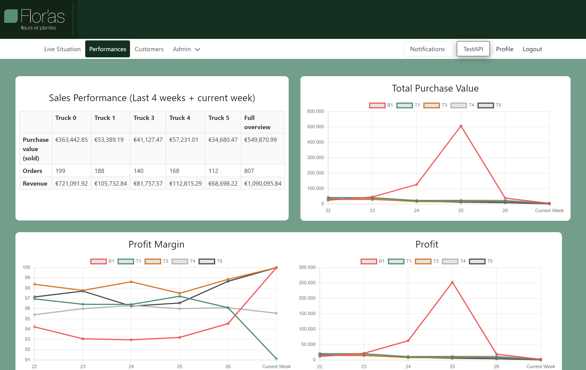
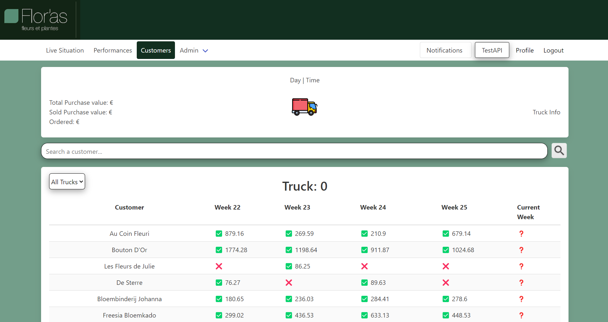
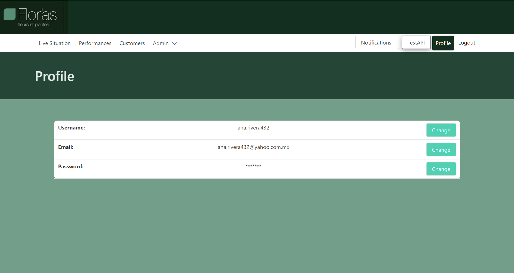
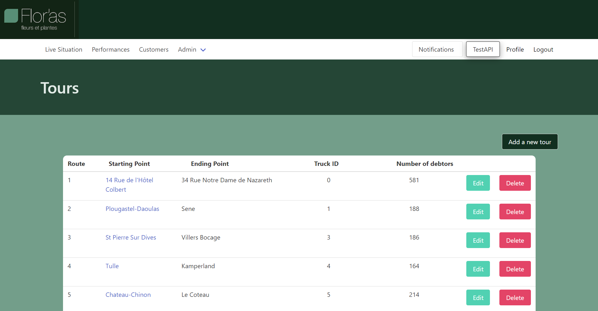
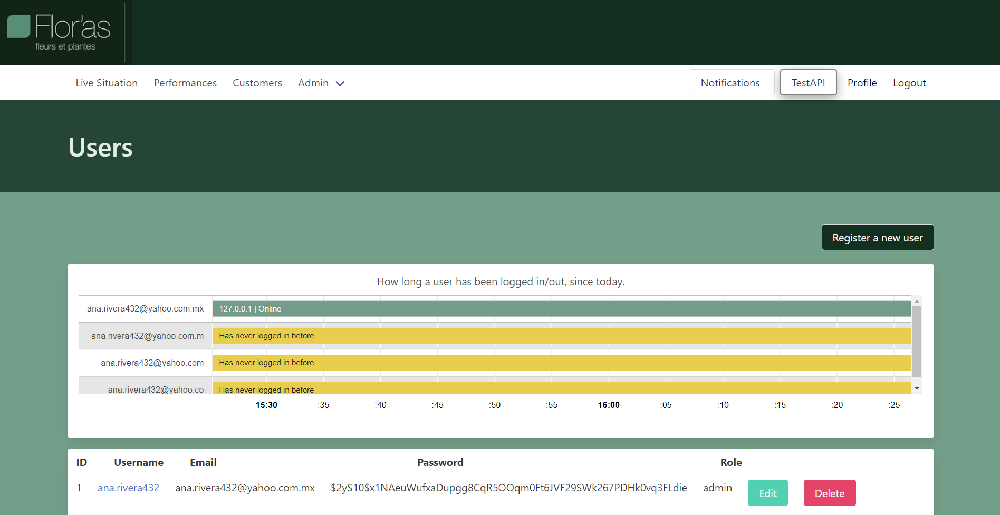

## Introduction
Welcome to the fpr-team01 wiki! This project was created for the Van As Bloemen company. The company uses 3 systems: EasyFlor, Unit4 and FleetVisor. From these systems, EasyFlor is the most important one. Here is where they record all the orders, customers' information, purchases and more. The problem is that it is hard to obtain a general overview of all the data in a single dashboard. Therefore, we created this dashboard, mainly for the CEO of the company and the logistics manager.

The dashboard contains three main pages: Live Situation, Performances and Customers. The live situation shows information about the sales performance at the moment per truck. The performances page shows past data, so that the client can analyze if the company is being profitable. Finally, the customers' page shows a clear overview of the customers per truck and their respective invoices. The data is being displayed using the EasyFlor API. Finally, our dashboard also provides admin permissions to the logistics manager, in order to be able to create new users and modify the routes of the company.

## Register
In order to get an account in our dashboard (maybe you have not realized, but there is not a register option), you have to run a php command to create an admin account. To do so run `php artisan admin:create <your_email>`. This command will provide you a default password '123456'. Later you can use this credentias to login, and you will be redirected to a page to change your password. This step is done to reinforce the security of the account.

## Live Situation
After logging in, you will be redirected to the "live situation" page. On this screen you can see the live status of the company. You will see information like, total purchase value, remaining purchase value and total revenue per truck. In the future, this page can be further develop to access the FleetVisor API, and display the location per truck on real time.

## Performances
The performances page is based on the sales of the company. It displays information based on past data obtained from the EasyFlor API. This page is divided into two sections. The first sections is a table with the overall and per truck sales performance. This includes the purchase value (sold), revenue of each truck in euros, and the profit margin in percentage. The second section shows three line charts about: the total purchase value of the trucks week by week, the profit margin, and the revenue of the trucks. If you press on the different buttons of the trucks legend, the line of the specific truck will not be displayed. This helps get a clearer overview to analyze each truck's performance.

## Customers
This page displays all the debtors by the truck they are assigned to in EasyFlor. From each debtor you can see their invoices from the current week to 4 weeks back. You can also use the search bar to look for a specific customer and use the dropdown menu to filter the table per truck.
* If there is an invoice ✅
* If there is not an invoice ❌
* If there is not and invoice, but an invoice could still come through ❓
* If a purchase was made, but they refunded 🟡

## Profile
In this page you can modify you account information, like email, password and username! In case you created your admin account with the php artisan command, your username was set to the first part of your email. If you wish to change this, this is the place to do so!

## Admin Extra Features

### Tours
The routes that the trucks drive through are set up by the company. Therefore, here the admin can edit those routes, which are linked to a truck, and the customers. The API is also used here to display the number of customers' per truck.

### Users
As an admin you can register new users. The new users can be registered as admins or normal users. Whenever the new user uses the credentials provided by the admin creator, he will be redirected to change his password (just as the admin had to when running the php artisan command). This step is made to assure that the user personalizes his password and reinforces the security of their account. Finally, the admin can also delete or edit users' information.

## Credits
This dashboard was created by: Ivo Petkov, Ana Rivera Faraco, Clint Eschenhorst, Lewie Zhu, Vesper Velkova, Odin Spape and Borna Vileta.
It would not have been possible with the enormous collaboration from our client, Han Van As, and the guidance of our lecturer Remco Kok.

